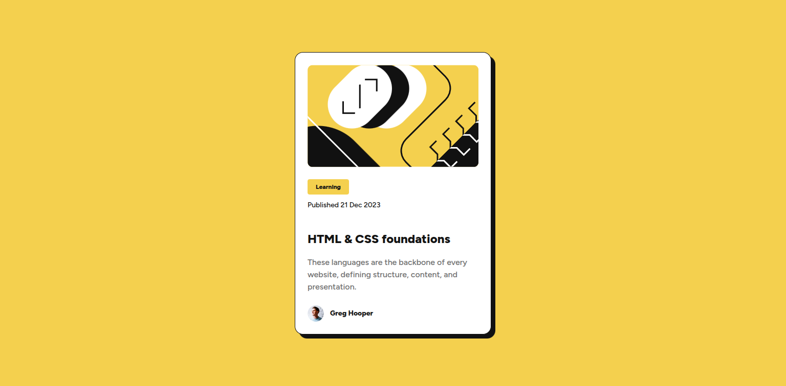

# Frontend Mentor - Blog preview card solution

This is a solution to the [Blog preview card challenge on Frontend Mentor](https://www.frontendmentor.io/challenges/blog-preview-card-ckPaj01IcS). Frontend Mentor challenges help you improve your coding skills by building realistic projects.

## Table of contents

- [Overview](#overview)
  - [The challenge](#the-challenge)
  - [Screenshot](#screenshot)
  - [Links](#links)
- [My process](#my-process)
  - [Built with](#built-with)
- [Author](#author)
- [Acknowledgments](#acknowledgments)

**Note: Delete this note and update the table of contents based on what sections you keep.**

## Overview

### The challenge

Users should be able to:

- See hover and focus states for all interactive elements on the page

### Screenshot

### Links

- Solution URL: [My solution on frontendmentor](https://github.com/afuhflynn/blog-preview-card)
- Live Site URL: [Live version](https://hilarious-sfogliatella-ac10fa.netlify.app)

## My process

### Built with

- Semantic HTML5 markup
- CSS custom properties
- Flexbox

## Author

- Website - [Afuh Flynn](https://github.com/afuhflynn)
- Frontend Mentor - [@afuhflynn](https://www.frontendmentor.io/profile/afuhflynn)
- Twitter - [@afuhflynn](https://www.twitter.com/afuhflynn)

## Acknowledgments

A huge thank you to [Frontend Mentor](https://www.frontendmentor.io) for providing these incredible coding challenges that help developers like me improve our skills by building realistic projects. These challenges are an excellent way to practice modern web development techniques and learn new approaches to solving design problems.

The community at Frontend Mentor is also fantastic - always ready to provide feedback and support to help each other grow as developers.
